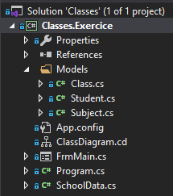
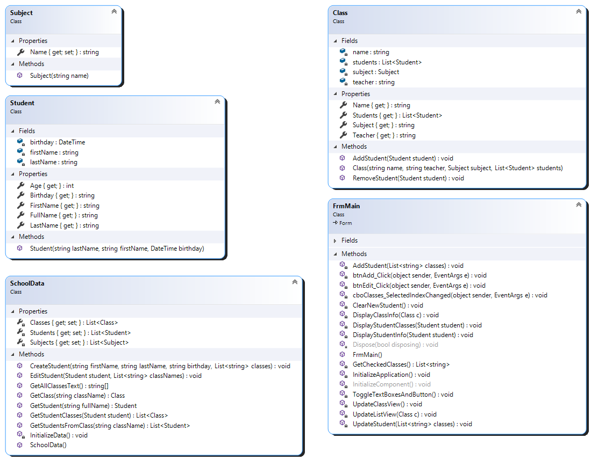

# Classes

This is a winforms app that manages school classes. User can create students and update their classes.

The classes to implement can be found below. Be sure to check the class diagram for a global view of the application.

## Solution Explorer Structure

> Note: The ClassDiagram.cd file should not be there

## Class Diagram

## Subject

> Note : the setter should be private

## Student

| Property | Description                                                                 |
| -------- | --------------------------------------------------------------------------- |
| Age      | Calculates and returns the student's age                                    |
| FullName | Returns the student's name with the following format: "LastName, FirstName" |

## Class

| Methods       | Description                                |
| ------------- | ------------------------------------------ |
| AddStudent    | Adds an existing student to the class      |
| RemoveStudent | Removes an existing student from the class |

## SchoolData

| Methods           | Description                                                           |
| ----------------- | --------------------------------------------------------------------- |
| CreateStudent     | Creates a student with their respective classes                       |
| Edit Student      | Modifies the student's classes                                        |
| GetAllClassesText | Returns all classes' names                                            |
| InitializeData    | Initializes the lists with the data found in the Initializer.txt file |

## FrmMain

| Events                          | Description                                             |
| ------------------------------- | ------------------------------------------------------- |
| btnAdd_Click                    | Creates or updates a student                            |
| btnEdit_Click                   | Displays the selected student's info on the right panel |
| cboClasses_SelectedIndexChanged | Updates the left panel                                  |

 

| Methods                  | Description                                                                                                           |
| ------------------------ | --------------------------------------------------------------------------------------------------------------------- |
| AddStudent               | Creates a user with the info provided in the UI                                                                       |
| ClearNewStudent          | Clears the texboxes and unchecks the items on the right panel                                                         |
| DisplayClassInfo         | Displays the subject and teacher's name of the selected class                                                         |
| DisplayStudentClasses    | Updates the chlClasses with the classes of the selected student                                                       |
| DisplayStudentInfo       | Displays the firstName, lastName and birthday of the selected student                                                 |
| GetCheckedClasses        | Returns a list with the name of the selected classes in the checkedListBox                                            |
| InitializeApplication    | Fills the combobox and checkedListBox with data from the SchoolData class                                             |
| ToggleTextBoxesAndButton | Toggles the enabled state of the textboxes on the right panel and updates the button text to either "Add" or "Update" |
| UpdateClassView          | Updates the left panel info with the selected class. Calls DisplayInfo() and UpdateListView()                         |
| UpdateListView           | Updates the listview content                                                                                          |
| UpdateStudent            | Edits the student with the new classes on the checkedListBox and calls ToggleTextBoxesAndButton()                     |
